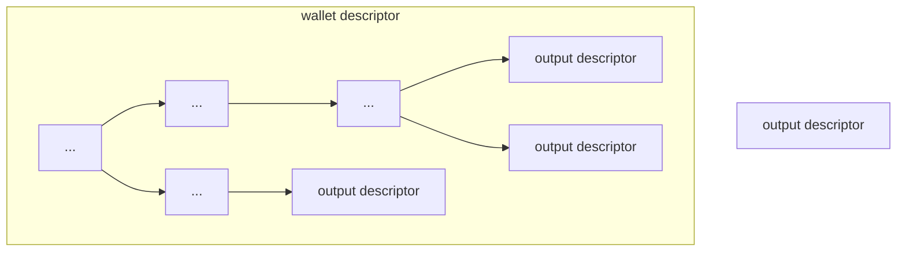

```mermaid
graph TD
  A[output descriptor]

  subgraph wallet descriptor
      B["..."] --> C["..."]
      C["..."] --> D["..."]
      D["..."] --> E[output descriptor]
      D["..."] --> F[output descriptor]

      B["..."] --> G["..."]
      G["..."] --> H[output descriptor]
  end
```
