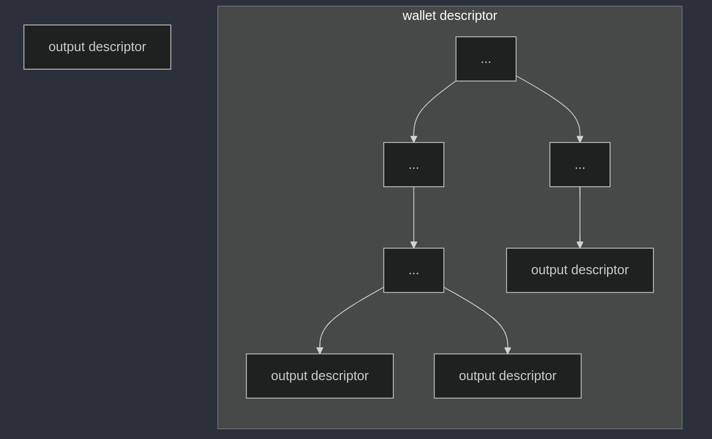
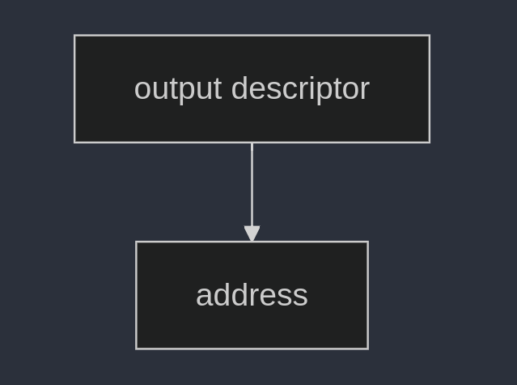

# output descriptors

Output descriptors solve the problem of ambiguity. a conventional wallet is made up of several parts, and prior solutions only provided pieces of the puzzle- leaving the whole picture obscured.

We're going to start by looking at the simplest possible output descriptor. Then, we'll move to explain the component parts, expand on those component parts, and finally assemble a _wallet descriptor_ which is an expandable collection of output descriptors mathematically related to each other in a _deterministic_ way.

Determinism simply refers to the guarantee that, if given the same inputs, you will always arrive at the same outputs when following a specific series of steps called an _algorithm_.


Therefore, a descriptor is simply a deterministic and unambiguous way to construct a bitcoin wallet.

The terms 'output descriptor' and 'wallet descriptor' are somewhat interchangeable. For clarity, I will refer to a descriptor that describes a single output, and therefore always derives the same address, as an 'output descriptor'. I will refer to a descriptor that can be used to generate many outputs, or addresses, as a 'wallet descriptor'. I may use the term 'descriptor' to generally refer to any descriptor.



Let's get started.

## resources

- BIP-380 -- Output Script Descriptors General Operation
  (The general descriptor reference)
  https://github.com/bitcoin/bips/blob/58ffd93812ff25e87d53d1f202fbb389fdfb85bb/bip-0380.mediawiki

- BIP-382 -- Segwit Output Script Descriptors
  https://github.com/bitcoin/bips/blob/58ffd93812ff25e87d53d1f202fbb389fdfb85bb/bip-0382.mediawiki

## addresses and output scripts

Most people normally interact with bitcoin addresses. It is common to say that we "send" bitcoin from one address to another. However, an address is actually a human-readable encoding of a script. These scripts are often called "locking scripts", "output scripts", or sometimes even simply 'outputs'.

Therefore, it is most accurate to say that bitcoin is locked to a specific output script which can later be unlocked.

An 'output descriptor' _describes_ the configuration of an output. A valid output descriptor provides all of the necessary information to construct the script for that output, and therefore can be used to construct a bitcoin address.

A wallet is a collection of one or more of these output scripts or addresses. Therefore, the simplest descriptor is a single output descriptor that can be used to create a single bitcoin address.



## descriptor components

For now, let's look at the components of a wallet descriptor. These are a `SCRIPT` expression and one or more `KEY` expressions. The top-level expression is always a `SCRIPT` expression, which tells the wallet software how to construct the script that will secure the funds. Different `SCRIPT` expressions may have different requirements to satisfy them, similar to a function signature in conventional programming. A `KEY` expression can be as simple as a single public or private key. More complex `KEY` expressions will be covered later.

### generate keypair using /dev/urandom and bitcoin-explorer

Let's generate a keypair on the command line using `bitcoin-explorer`. Another method is below.

Older versions of `bitcoin-explorer` included a `seed` command, which has been removed after many people burned themselves securing real bitcoin to addresses created in this way. I've recreated the `seed` command using native linux tools, but I must stress that this is not a secure way to generate a seed and should not be used with real funds.

```bash
$ xxd -l 24 -p /dev/urandom | bx ec-new
3c17fcc0af0e378598eea98bd812afecde3d52d546239064f8dc8a096c5de36c
```

Now, let's derive a public key from the private key we just generated

```bash
$ bx ec-to-public 3c17fcc0af0e378598eea98bd812afecde3d52d546239064f8dc8a096c5de36c
0263f6dada0227fda6e080311328ca3b0c81e6a8f36c66859ef4ef477cf4b20cb0
```

This public key is enough to create the simplest form of a `KEY` expression, many `SCRIPT` expressions can be satisfied with a single `KEY` expression, so we'll select one of those to continue our example.

We'll select the Native Segwit `SCRIPT` expression, defined in BIP-382, and wrap our public key in this expression. The details of Native Segwit itself are out of the scope of this series, but we will go into more detail on these script expressions in a later video.

```
wpkh(0263f6dada0227fda6e080311328ca3b0c81e6a8f36c66859ef4ef477cf4b20cb0)
```

Finally, we'll use BDK-CLI to derive the address using the descriptor we just created.

```bash
$ bdk-cli --network testnet wallet --descriptor "wpkh(0263f6dada0227fda6e080311328ca3b0c81e6a8f36c66859ef4ef477cf4b20cb0)" get_new_address
{
  "address": "tb1qeh92p5udelmeautcsu6h0m0sqq68f2lgfjcyfl"
}
```

NOTE: `--network testnet` is the default, so it can be omitted. I have used it explicitly to reinforce that you should not use this key pair to secure real bitcoin because the private key was not created in a secure way.

## generate keypair using simple javascript tools

I've written several bite-sized scripts using common bitcoin packages. The code should be easy enough to understand, and includes comments to help guide you.

https://github.com/turkycat/extended-key-tools

Here's how we can perform the same steps using this repo.

### verifying our bitcoin-explorer result

verify our `bitcoin-explorer` result

```bash
$ node unsafe-keypair-generator.js --private-key 3c17fcc0af0e378598eea98bd812afecde3d52d546239064f8dc8a096c5de36c
provided private key   : 3c17fcc0af0e378598eea98bd812afecde3d52d546239064f8dc8a096c5de36c
public key             : 0263f6dada0227fda6e080311328ca3b0c81e6a8f36c66859ef4ef477cf4b20cb0
```

### other examples

example 1, step by step:

```bash
$ node unsafe-entropy-generator.js
generated new entropy  : 8b1da77e3183098c96c79363b5d99082

$ node unsafe-keypair-generator.js --entropy 8b1da77e3183098c96c79363b5d99082
provided entropy       : 8b1da77e3183098c96c79363b5d99082
private key            : 6ef34feaf7f4581960b7083fe842408a1c6e3f1d0993c318edc6b9e5de055922
public key             : 02fdcd8a5a8b8bf82db7296ee7087e773bbd144edb183452eede30fc785ca0b6fa
```

example 2, all in one:

```bash
$ node unsafe-keypair-generator.js
generated new entropy  : 7b1ed2bc00ca3562688e05f40d46df67
private key            : 09eb2d712d8b3cb039a7a38a062877f012430ec151aaadf89a294afbc6312a09
public key             : 02145c5743d2420a2ecece8cfacce3b1e0441596adfdc1759ae8d0186bd1b867a3
```

## conclusion

That's it for now! In the next video I will break down the process by which the descriptor is converted into a bitcoin address.
